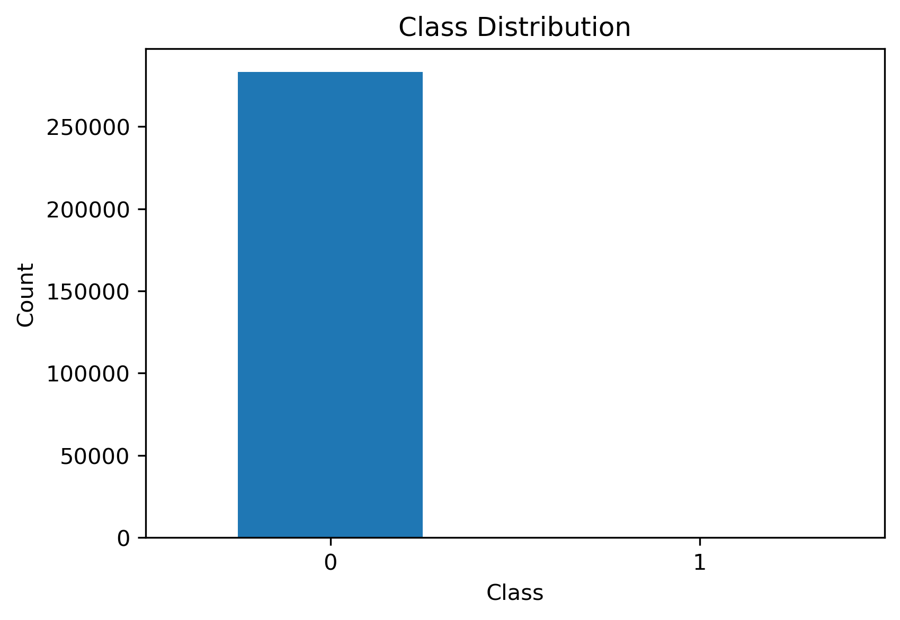
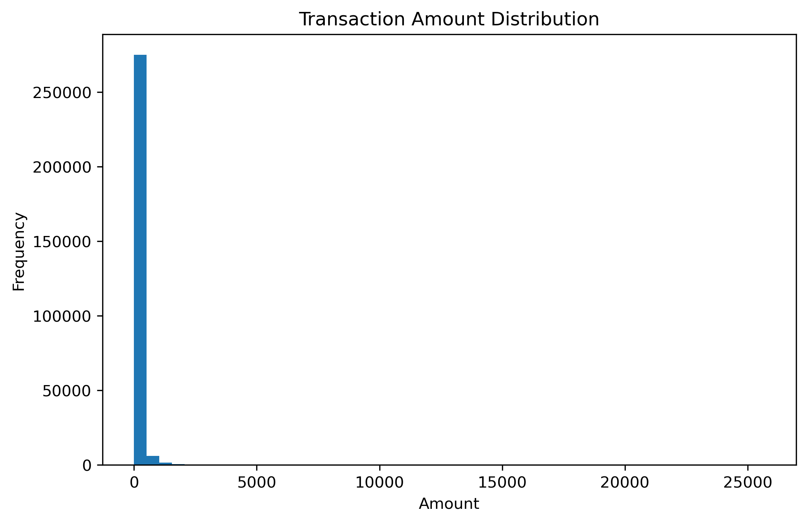
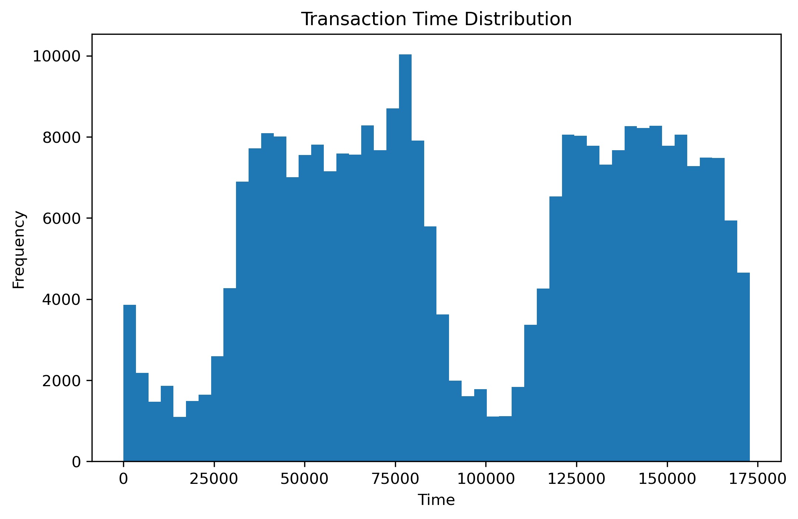
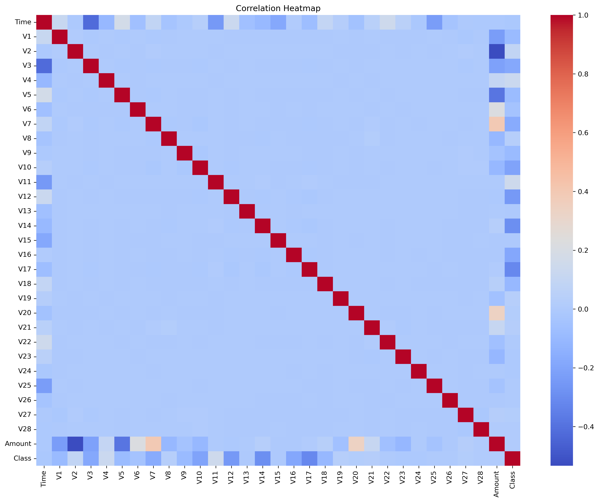
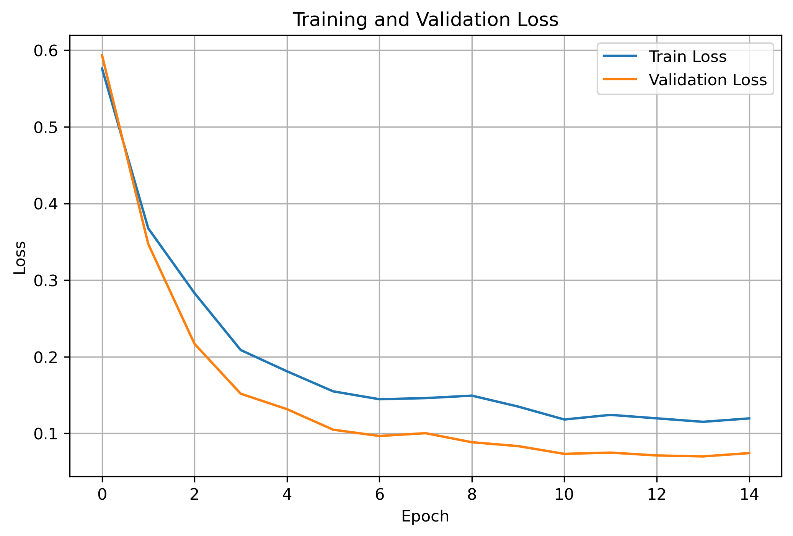
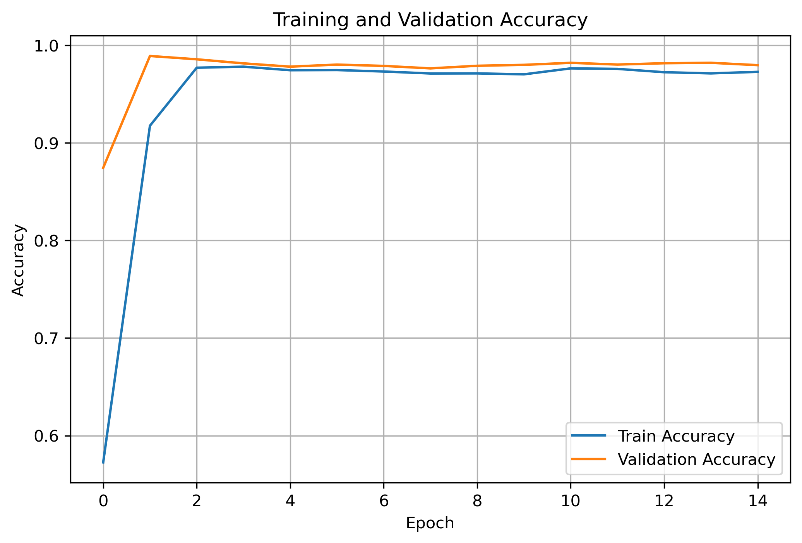
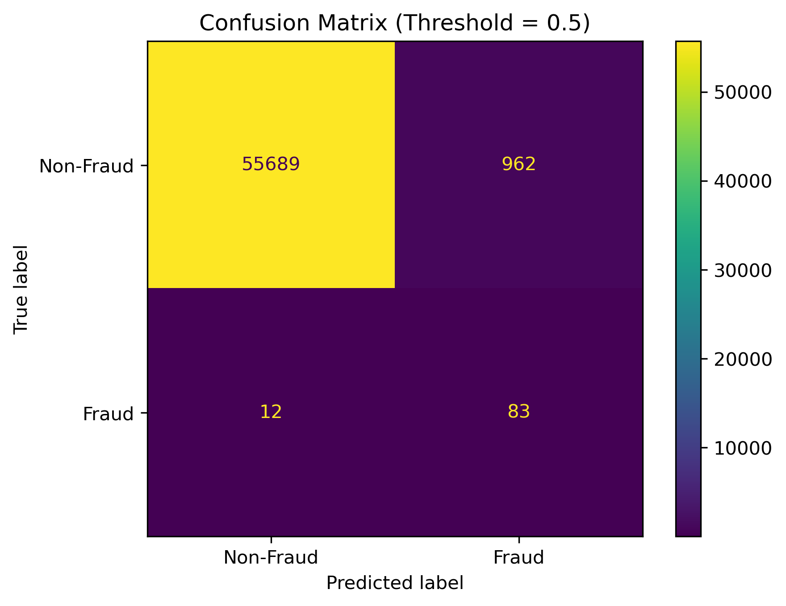
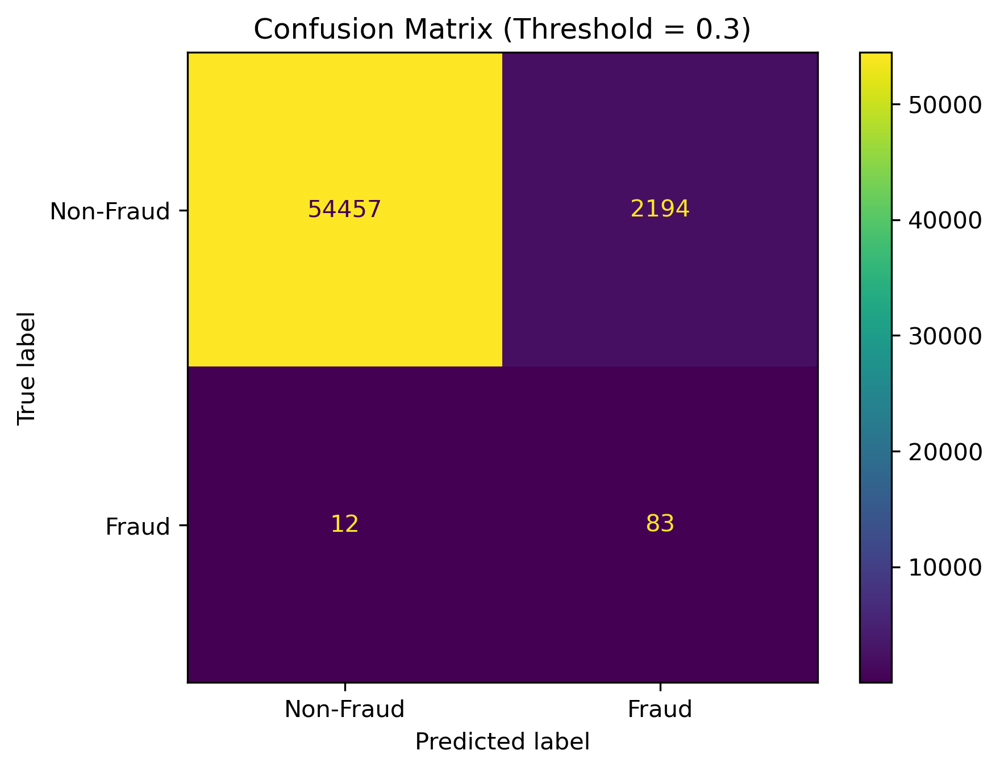

# credit-card-fraud-detection-using-deep-learning
A deep learning project that detects fraudulent credit card transactions using an ANN model and threshold analysis on the Kaggle fraud dataset.

# Credit Card Fraud Detection Using Deep Learning

## Project Overview

This project applies deep learning to detect fraudulent credit card transactions. It is a binary classification problem where:

- **0 = normal transaction**
- **1 = fraudulent transaction**

I chose this topic because fraud detection is an important real-world problem in finance. Even though fraudulent transactions represent only a very small part of the data, failing to detect them can lead to serious financial loss. This makes the task both practical and challenging, especially because the dataset is highly imbalanced.

---

## Dataset

This project uses the **Credit Card Fraud Detection** dataset from Kaggle.

The dataset contains credit card transactions made by European cardholders in **September 2013**. It includes transactions that occurred over **two days**, with:

- **284,807 total transactions**
- **492 fraudulent transactions**
- fraud cases representing only **0.172%** of the dataset

This makes the dataset **highly imbalanced**, which is one of the main challenges of the project.

Another important characteristic is that most variables have already been transformed using **PCA** for confidentiality reasons. As a result:

- **V1 to V28** are principal components obtained with PCA
- **Time** and **Amount** are the only features not transformed by PCA
- **Class** is the target variable:
  - `0` = normal transaction
  - `1` = fraudulent transaction

In particular:

- **Time** represents the number of seconds elapsed between each transaction and the first transaction in the dataset
- **Amount** represents the transaction amount

Because the dataset is extremely imbalanced, accuracy alone is not a reliable evaluation metric. For this type of problem, metrics such as **Precision, Recall, F1-score**, and especially the **Area Under the Precision-Recall Curve (AUPRC)** are more meaningful than simple accuracy.

### Class Distribution

This chart clearly shows that fraud cases are much fewer than non-fraud cases. Because of this imbalance, the project must go beyond accuracy and focus more on fraud-sensitive metrics.

---

## Data Exploration

### Transaction Amount Distribution

Most transactions have relatively small values, while only a small number have large amounts.

### Transaction Time Distribution

This figure shows how transactions are distributed over time.

### Correlation Heatmap

The heatmap provides an overview of the relationships between variables in the dataset.

---

## Preprocessing

The main preprocessing steps were:

- checking dataset shape
- checking missing values
- removing duplicate rows
- splitting features and target
- scaling `Time` and `Amount`
- splitting the data into training and testing sets

I only scaled `Time` and `Amount` because, according to the dataset description, features `V1` to `V28` had already been transformed using PCA.

---

## Model

I used an **Artificial Neural Network (ANN)** for this project.

This model was chosen because it can learn non-linear patterns in numerical data and works well for binary classification tasks.

---

## Training Results

### Training and Validation Loss

The loss curves decrease over time, which indicates that the model learned useful patterns from the data and improved during training.

### Training and Validation Accuracy

The accuracy curves show that the model achieved strong overall performance. However, because the dataset is highly imbalanced, accuracy is not the most important metric.

---

## Threshold Analysis

To better evaluate the model, I compared predictions at different thresholds.

### Threshold = 0.5

This is the default threshold and provides a basic balance between fraud detection and false alarms.

### Threshold = 0.3

A lower threshold makes the model more sensitive to fraud. This usually improves recall, meaning more fraud cases are detected, but it can also increase false positives.

---

## Key Insight

The most important lesson from this project is that **accuracy alone is not enough** for fraud detection.

Because the dataset is extremely imbalanced:

- a **lower threshold** can help detect more fraudulent transactions
- a **higher threshold** can help reduce false alarms

This means threshold selection should depend on the real business objective.

---

## Conclusion

This project shows that deep learning can be applied effectively to credit card fraud detection. The ANN model was able to learn patterns from the data and produce useful results, especially when combined with threshold analysis.

Overall, this project highlights the importance of choosing suitable evaluation metrics and understanding the trade-off between detecting more fraud cases and reducing false alerts.

---

## Technologies Used

- Python
- Pandas
- NumPy
- Matplotlib
- Seaborn
- Scikit-learn
- TensorFlow / Keras
